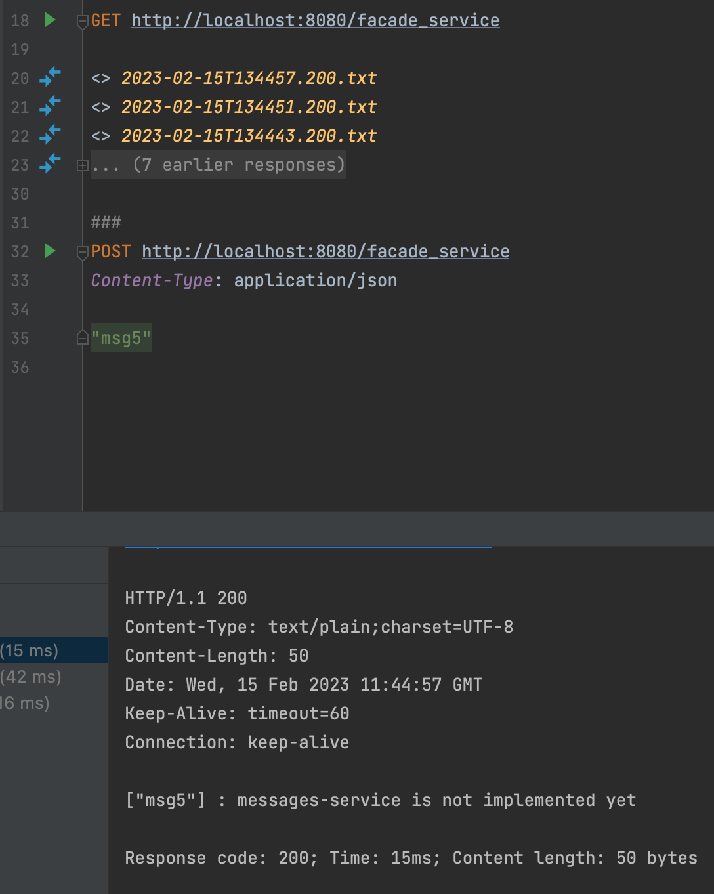
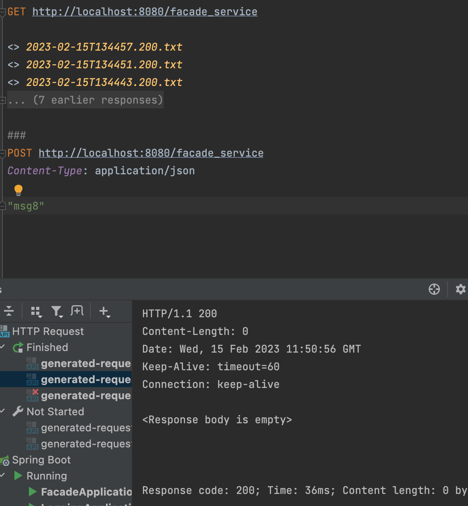
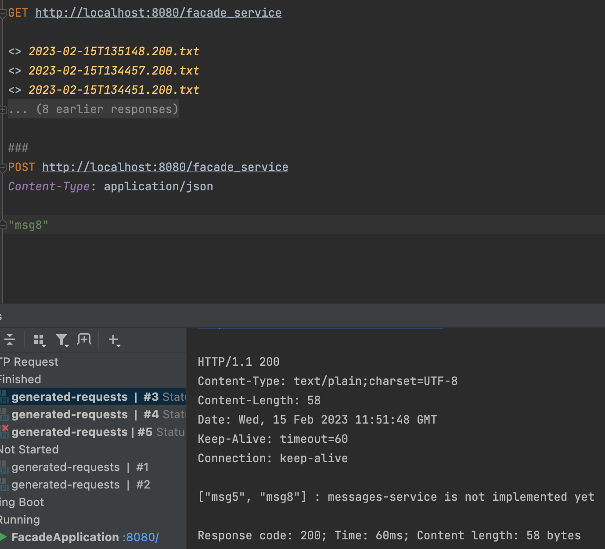

# SoftArch_lab №1 
About: microservices simple implementation java  
Student: Zhurba Inna  

## Additional info

Implemented 3 microservices:  
 - facade: is a comunicational service that control requests to other two services;  
 - logger: save messages from the clients that ask for it using facade and send saved messages if it is requested;  
 - messages: for now it has static message on GET request. 

## Screenshots

GET result after POST with "msg5":  

POST with "msg8":  

GET result after POST with "msg8":  
